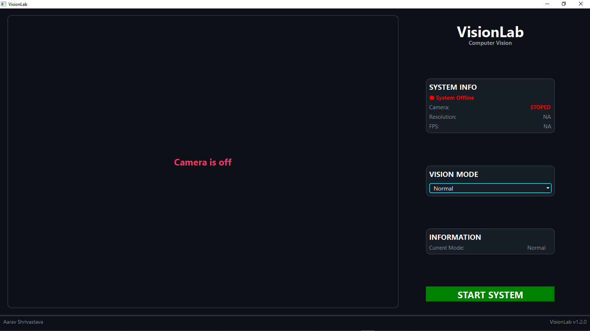
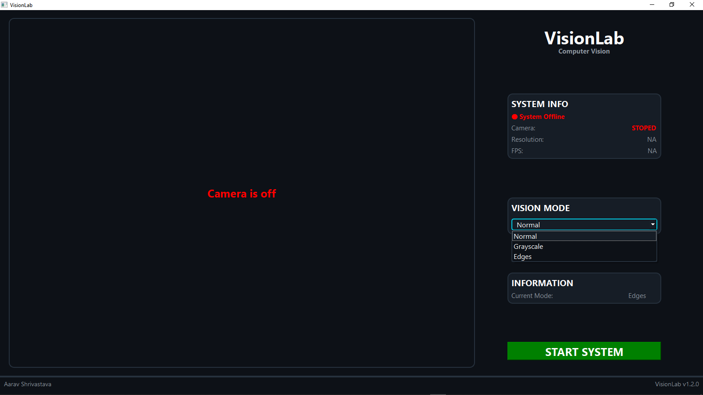
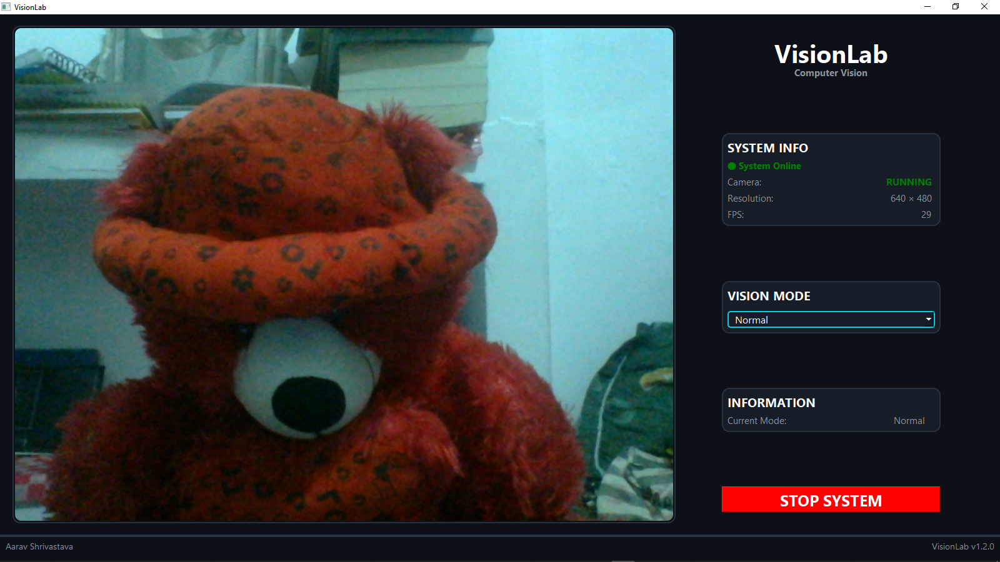
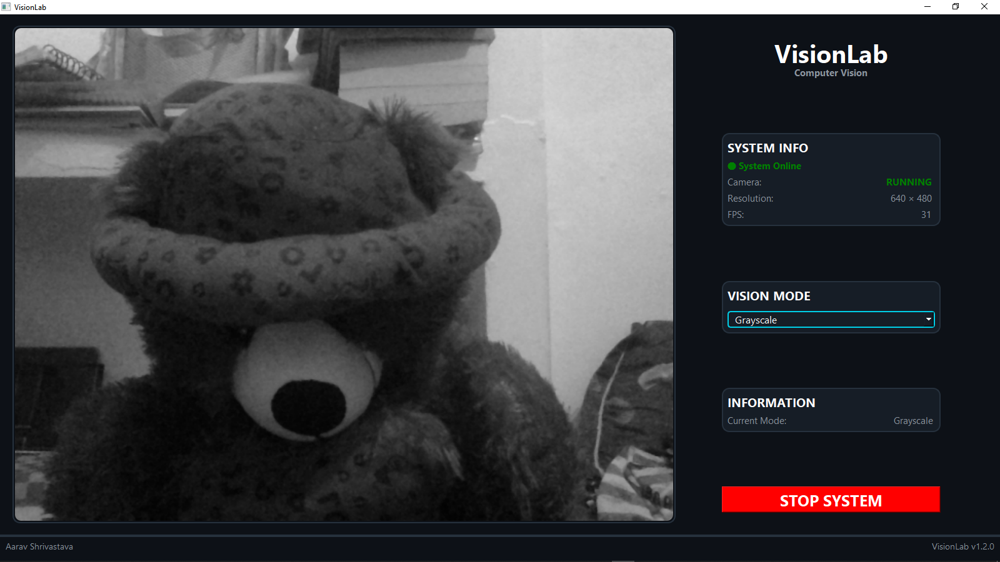
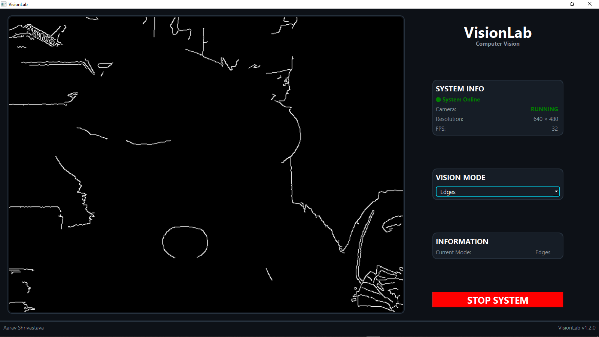

# **VisionLab**


VisionLab is a real-time computer vision experiment with the intention of exploring the possibility of new ways to interact with and control computer vision through a camera.

The current version features real-time camera processing with multiple vision modes while the future versions intend on implementing gesture-based controls for the computer vision system

---

# Installation

<p style="font-size: 20px; font-weight: bolder;">Method-1</p>

STEP 1: Install .zip file from <a href="https://github.com/aaravshrivastava4129/VisonLab/releases/tag/v1.2.2">Releases</a>.

STEP 2: Extract it.

STEP 3: Go to VisionLab -> dist -> main

STEP 4: Double-click main.exe

<p style="font-size: 20px; font-weight: bolder;">Method-2</p>

STEP 1: Clone the repository

```bash

git clone https://github.com/aaravshrivastava4129/VisonLab.git

```

STEP 2: Go to the project folder

```bash

cd VisionLab

```

STEP 3: Install the required packages

```bash

pip install -r requirements.txt

```

STEP 4: Run the project

```bash

python main.py

```

---

# How To Use

To open project go to **VisionLab -> dist -> main** and double-click **main.exe**

Click **START SYSTEM** button to start camera.

Change vision modes from side pannel.

To close camera click **STOP SYSTEM** button.

_*Make sure your camera is connected to your laptop or PC._

---

# AI Uses

AI is used in development of VisionLab only for learning, debugging.

AI was used:
- for generating image of sample GUI.
- for understanding OpenCV, Qt layout and Pyside6 concepts.
- for debugging and finding the solutions to solve errors.

---

# Demo Video
_*This project is in active development, so the videos provided in the README may vary from the actual product._

<video src="https://github.com/user-attachments/assets/02eafeff-86f2-48e6-ae98-640dbd39c3d2" width="40%" controls></video>

---

# Screenshots
_*This project is in active development, so the screenshots provided in the README may vary from the actual product._

<p style="font-size: 20px; font-weight: bolder;">Main Interface</p>



<p style="font-size: 20px; font-weight: bolder;">Main Interface With Mode Menu</p>



<p style="font-size: 20px; font-weight: bolder;">Normal Vision Mode</p>



<p style="font-size: 20px; font-weight: bolder;">Grayscale Vision Mode</p>



<p style="font-size: 20px; font-weight: bolder;">Edge Detection Mode</p>



---

# Current Features

- <p style="font-size: 20px; font-weight: bolder; margin-bottom: 0;">Real Time Camera Feed</p> A real time camera feed is displayed in its own dedicated visual interface. The camera is mirrored so that it can be used as a natural control input.

- <p style="font-size: 20px; font-weight: bolder; margin-bottom: 0;">Vision Modes</p> <p style="font-weight: bolder;"> &nbsp; There are 3 vision modes: <br> &nbsp; &nbsp; <a style="font-weight: bold;">1. Normal Mode - </a> <a style="font-weight: normal;">The camera view is displayed normally.</a> <br> &nbsp; &nbsp; <a style="font-weight: bold;">2. Grayscale Mode - </a> <a style="font-weight: normal;">The camera view is converted to grayscale.</a> <br> &nbsp; &nbsp; <a style="font-weight: bold;">3. Edge Mode - </a> <a style="font-weight: normal;">The camera view has its edges extracted.</a> </p> Vision modes can be change through dedicated mode selector in side panel.

- <p style="font-size: 20px; font-weight: bolder; margin-bottom: 0;">System Information</p> <p style="font-weight: bolder;"> &nbsp; Following system informations can be viewed: <br> &nbsp; &nbsp; <a style="font-weight: bold;">1. System status - </a> <a style="font-weight: normal;">View if the system is online/offline.</a> <br> &nbsp; &nbsp; <a style="font-weight: bold;">2. Camera status - </a> <a style="font-weight: normal;">View if the camera is online/offline.</a> <br> &nbsp; &nbsp; <a style="font-weight: bold;">3. Camera resolution - </a> <a style="font-weight: normal;"> View total number of pixels in single frame.</a> <br> &nbsp; &nbsp; <a style="font-weight: bold;">4. FPS counter - </a> <a style="font-weight: normal;"> View how many frames are rendering in a second.</a> <br> &nbsp; &nbsp; <a style="font-weight: bold;">5. Current Vision Mode - </a> <a style="font-weight: normal;"> View the current camera mode (e.g., Normal, Grayscale, or Edge).</a> </p>

---

# Upcoming Features

- <p style="font-size: 15px; font-weight: bolder; margin-bottom: 0;">Hand gestures to toggel vision modes.</p>
- <p style="font-size: 15px; font-weight: bolder; margin-bottom: 0;">Face expression detection.</p>
- <p style="font-size: 15px; font-weight: bolder; margin-bottom: 0;">Hand gestures to controll cursor.</p>

**Next Major Update: 🖐️ Four-Finger Gesture-Based Interaction**

---